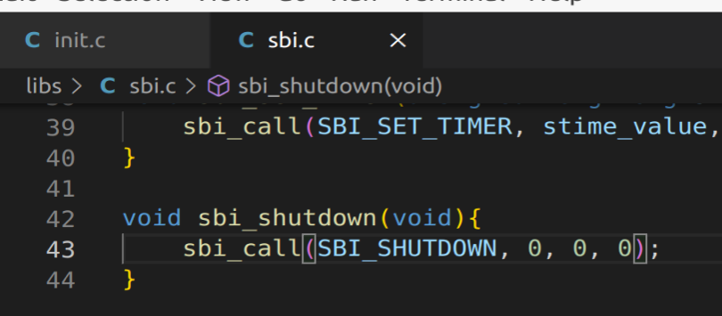

# OS Assignment 2 Report
name: 刘乐奇
sid: 12011327
Ubuntu用户名：lynchrocket

1. 解释指令中每个参数的作用
```
# 模拟 64-bit 的 RISC-V 机器
qemu-system-riscv64 \
    # 指定 qemu 模拟平台是 virt
    -machine virt \
    # 指定无图形界面
    -nographic \
    # 指定 bootloader 为默认
    -bios default \
    # 指定设备的文件
    -device loader,file=bin/ucore.bin,addr=0x80200000
```

2. 解释 /lab/tools/kernel.ld 片段中每一行的作用
```ld
/* SECTIONS描述了输出文件的内存布局 */
SECTIONS
{
    /* . 是location counter，如果不指定output section的地址，该地址会被默认设置为location counter的当前值。location counter会根据output section的大小自动增加，在SECTIONS命令的开始处的location counter的值为0。此处指定了location counter的值为BASE_ADDRESS */
    /* Load the kernel at this address: "." means the current address */
    . = BASE_ADDRESS;

    /* .text 指定代码段。此处指定output section的代码段要将input section中的.text.kern_entry，.text，.stub，.text.*，.gnu.linkonce.t.*加载进来 */
    .text : {
        *(.text.kern_entry)
        *(.text .stub .text.* .gnu.linkonce.t.*)
    }

    /* PROVIDE 定义一个（目标文件内被引用但没定义）符号。相当于定义一个全局变量的符号表，其他C文件可以通过该符号来操作对应的存储内存。 */
    PROVIDE(etext = .); /* Define the 'etext' symbol to this value */

    /* .rodata 指定只读代码段。此处指定output section的只读代码段要将input section中的.rodata， .rodata.*， .gnu.linkonce.r.*加载进来 */
    .rodata : {
        *(.rodata .rodata.* .gnu.linkonce.r.*)
    }

    /* 分页地址对齐 */
    /* Adjust the address for the data segment to the next page */
    . = ALIGN(0x1000);
```

3. 解释 /lab/kern/init/init.c 中 main函数中 memset(edata, 0, end - edata); 的参数及语句作用

`memset(edata, 0, end - edata);` 将 edata 所指向的字符串的前 end-edata 个字符置为 0 \
注意到 /lab/kern/init/init.c 中有如下两行。`extern`关键字说明 edata 和 end 都是外部引用。
```c
extern char edata[], end[];
memset(edata, 0, end - edata);
```
注意到 /lab/tools/kernel.ld 中有如下几行。说明上面的 init.c 中的 `memset(edata, 0, end - edata);` 将 .bss 段中的内容全部置为0
```ld
    PROVIDE(edata = .);

    .bss : {
        *(.bss)
        *(.bss.*)
        *(.sbss*)
    }

    PROVIDE(end = .);
```

4. 描述cputs()指令是如何通过sbi打印字符的

cputs() 调用了 cputch()，cputch() 调用了 cons_putc()，cons_putc() 调用了 sbi_console_putchar()，sbi_console_putchar() 调用了 sbi_call()，sbi_call() 有如下的内联汇编。
```c
uint64_t sbi_call(uint64_t sbi_type, uint64_t arg0, uint64_t arg1, uint64_t arg2) {
    uint64_t ret_val;
    __asm__ volatile (
        "mv x17, %[sbi_type]\n"
        "mv x10, %[arg0]\n"
        "mv x11, %[arg1]\n"
        "mv x12, %[arg2]\n"
        "ecall\n"
        "mv %[ret_val], x10"
        : [ret_val] "=r" (ret_val)
        : [sbi_type] "r" (sbi_type), [arg0] "r" (arg0), [arg1] "r" (arg1), [arg2] "r" (arg2)
        : "memory"
    );
    return ret_val;
}
```

5. 使用ecall打印字符的原理，实现一个
shutdown() 关机函数

/libs/sbi.c


/kern/init/init.c


运行结果
