# OS Assignment 4 report
name: 刘乐奇

SID: 12011327

Ubuntu用户名: lynchrocket

## 1. CPU Scheduling

| Time | HRRN | FIFO/FCFS | RR | SJF | Priority |
|---|---|---|---|---|---|
| 1 | A | A | A | A | A |
| 2 | A | A | A | A | B |
| 3 | A | A | B | A | A |
| 4 | A | A | A | A | D |
| 5 | B | B | D | B | D |
| 6 | D | D | A | D | C |
| 7 | D | D | C | D | C |
| 8 | C | C | D | C | C |
| 9 | C | C | C | C | A |
| 10 | C | C | C | C | A |
| Avg. Turn-around Time | 4.5 | 4.5 | 4.75 | 4.5 | 4.25 |

## 2. Preemptive process scheduling

Add comment here to unable the clock interrupt. (/kern/init/init.c line 37)

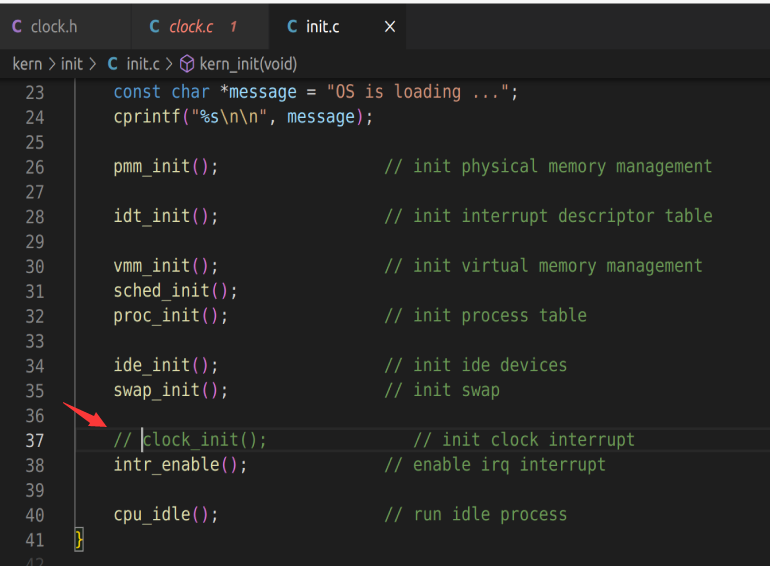

In /user/ex3.c line 41 we can find a function named `set_good()`. This is the function we need to write.

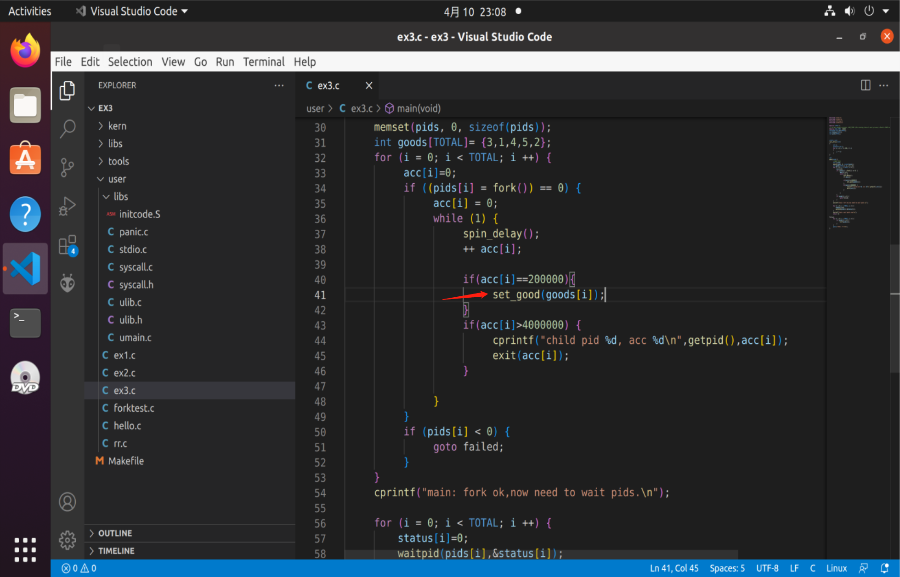

## In user mode

Declare `set_good()` in /user/libs/ulib.h and define in /user/libs/ulib.c

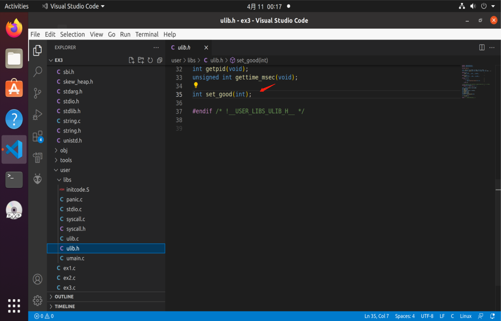

Write some code in /user/libs/syscall.h and /user/libs/syscall.c

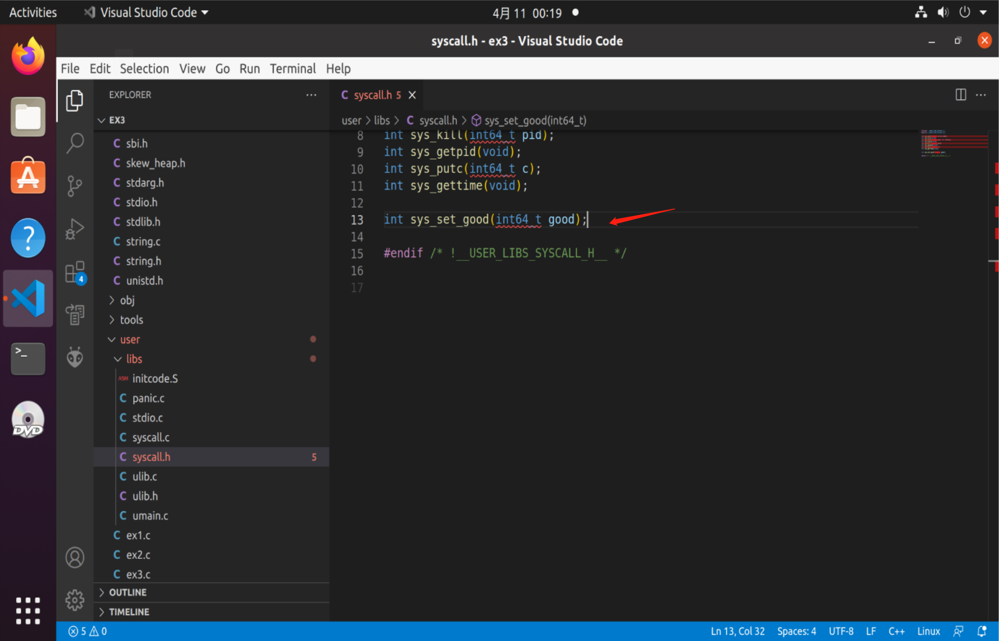

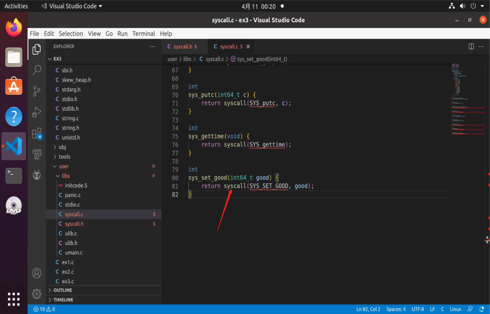

Notice that the constant `SYS_SET_GOOD` seems never being defined. So in /libs/unistd.h, add a line of code. Set `6` as requested.

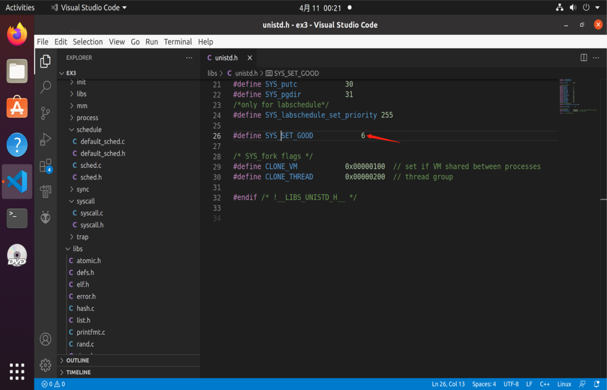

## In kernel mode

We need to add some code in /kern/syscall/syscall.c

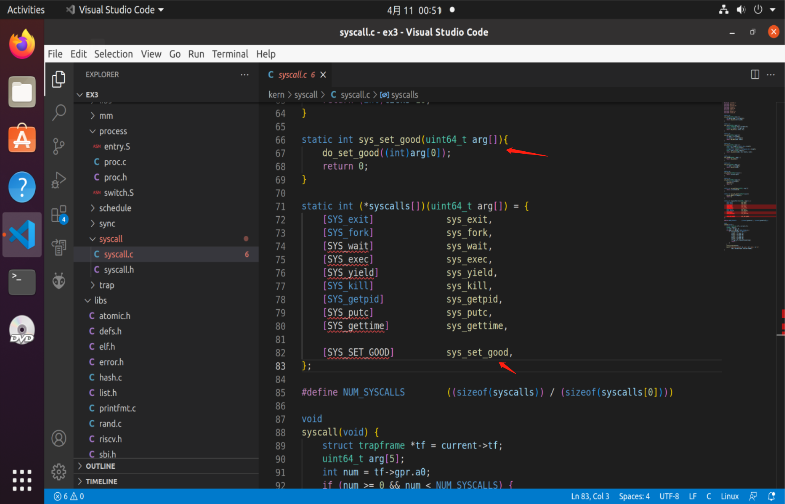

In /kern/process/proc.h and /kern/process/proc.c

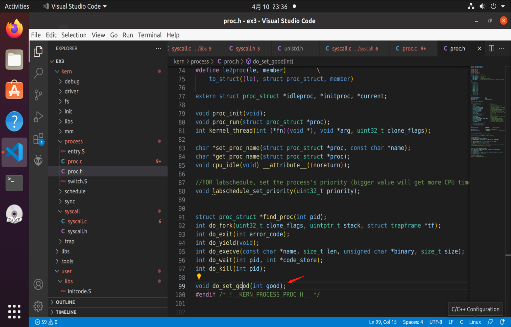

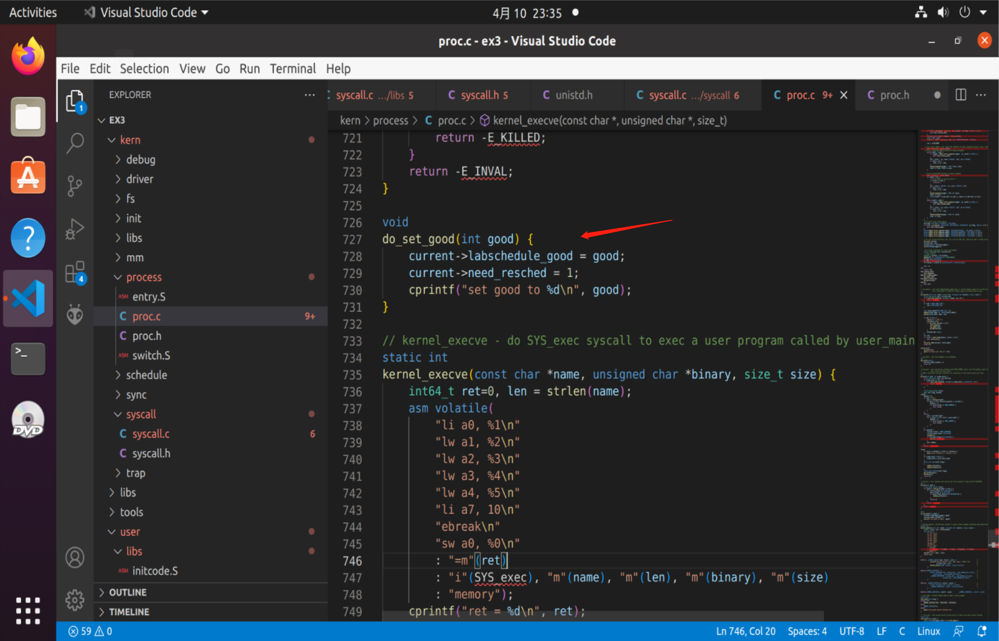

At this time, a process can syscall to modify `labschedule_good`. The next task we need to do is to finish process scheduling. (in /kern/schedule/default_sched.c)

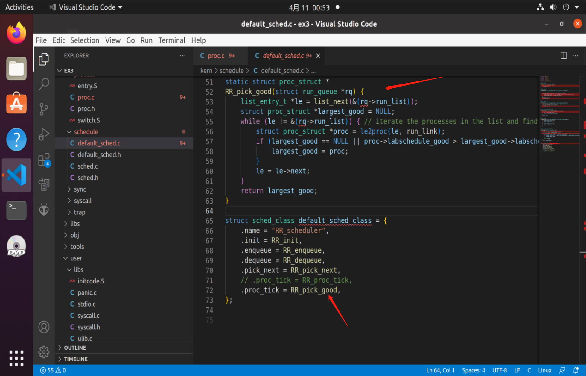

Do not forget here!!

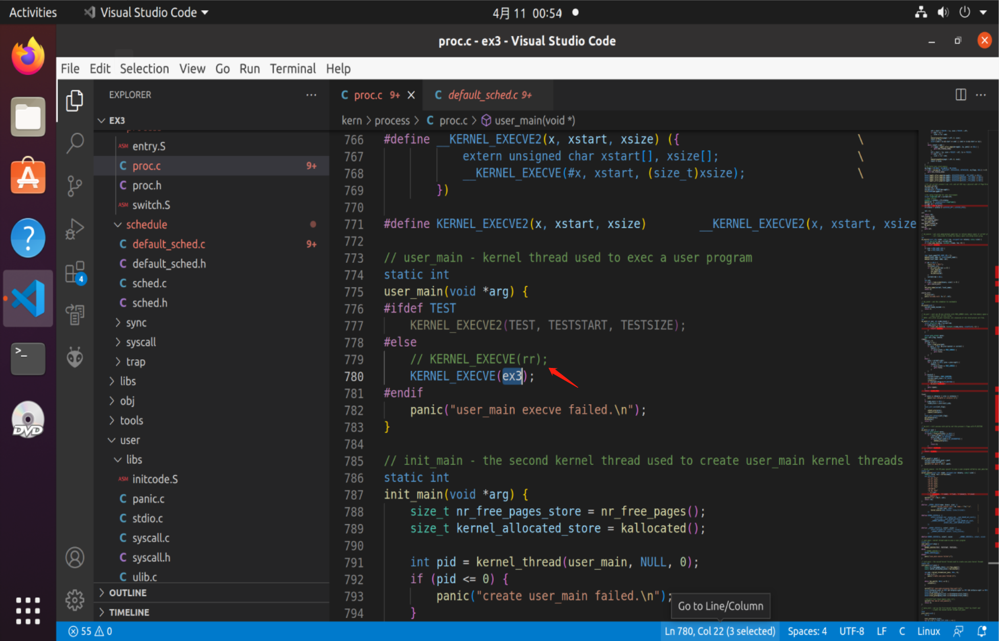

The result is

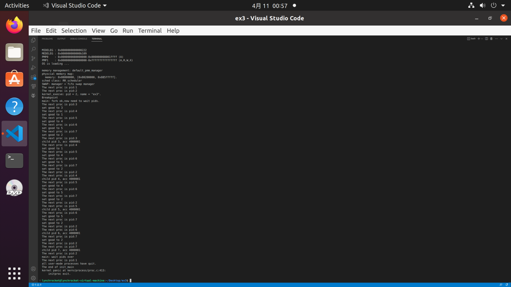