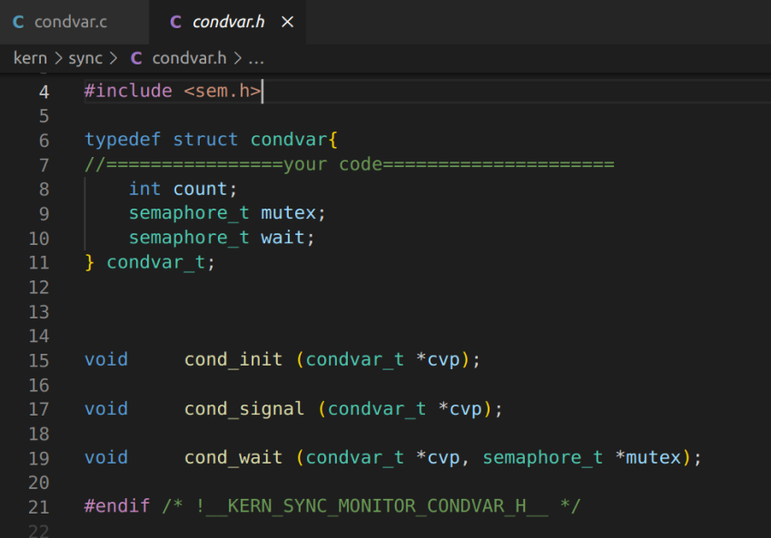
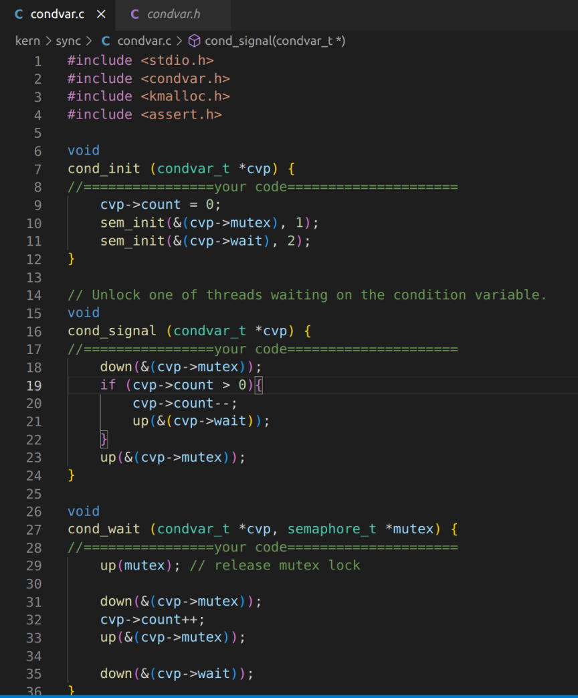
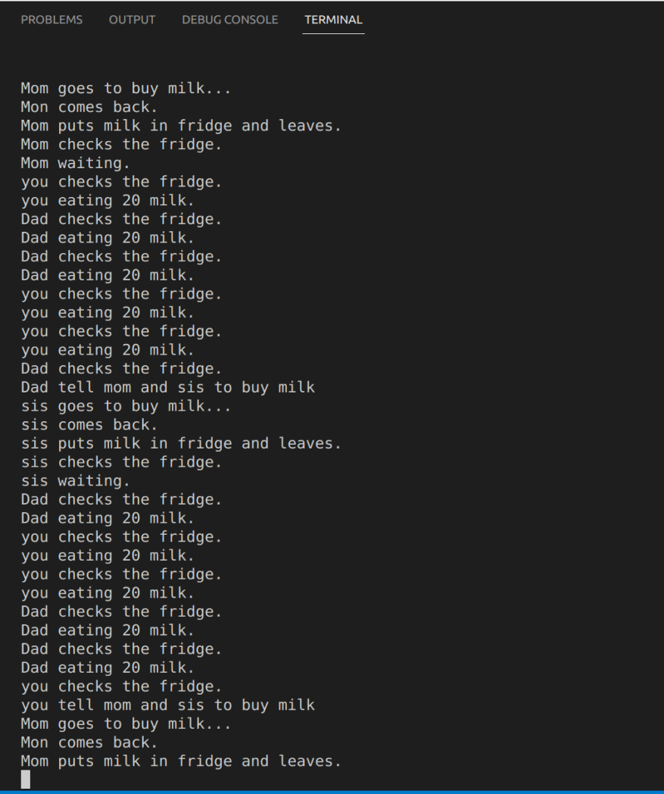

# OS Assignment 8 Report
name：刘乐奇

sid：12011327

Ubuntu用户名：lynchrocket

## 1. I/O

### (1) What are the pros and cons of polling and interrupt-based I/O?

|  | pros | cons |
|---|---|---|
| polling | simple & practical | inefficient & inconvenient |
| interrupt | no spinning during I/O | context switch costs |

### (2) What are the differences between PIO and DMA?

|| PIO | DMA |
|---|---|---|
| need CPU ? | CPU controls | no need of CPU |
| transfer speed | slower | faster |
| devices used for | slower devices | high-speed devices |
| who does data copy ? | CPU | DMA controller |

### (3) How to protect memory-mapped I/O and explicit I/O instructions from being abused by malicious user process?

1. Priviledge levels: Restrict access to memory-mapped I/O and explicit I/O instructions to trusted processes running at higher privilege levels.

2. Memory protection：Maintain a table that maps I/O instructions to specific devices and only allow authorized processes to use these instructions.

## 2. Condition variable

The definition of condition variable.

| name | description |
|---|---|
| count | the number of threads waiting on the conditional variable |
| mutex | a mutex lock used to protect the conditional variable, ensuring that only one thread can modify the state of the conditional variable at any given time |
| wait | a semaphore used to wait for the conditional variable, indicating how many threads are waiting for the state of the conditional variable to change |

The implement of functions. 

The condition variable needs to be initialized in `cond_init`. When invoking `cond_wait`, the mutex lock should be released first in case that other threads are blocked due to have not obtained the mutex lock. Then increase the `count` of condition variable by `1` between a mutex lock in case other threads modify the `count` concurrently, and be waiting. When invoking `cond_signal`, it will check if there is any thread waiting between a mutex lock. If yes, then decrease the `count` of condition variable by `1` and notify the waiting thread.

The running result is as below.

