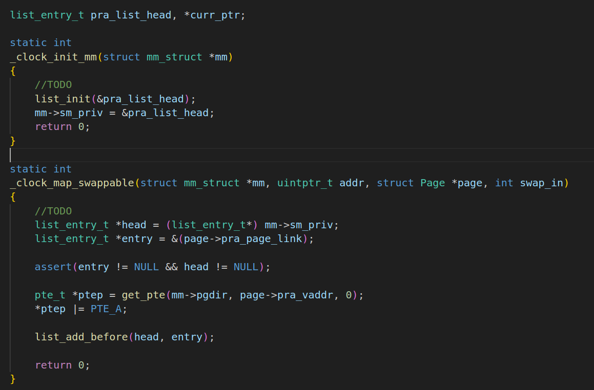
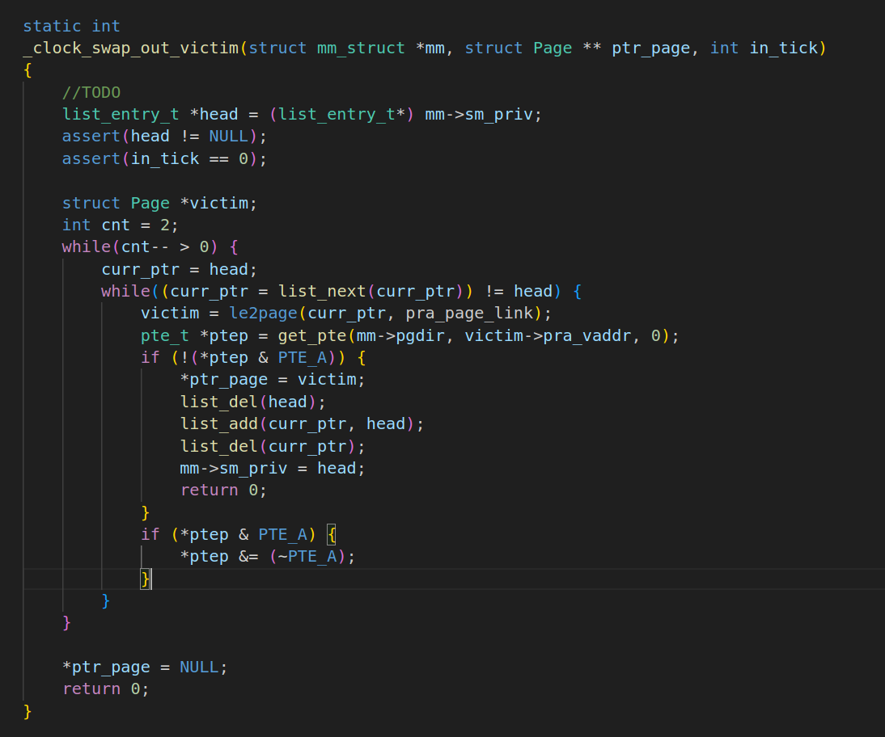
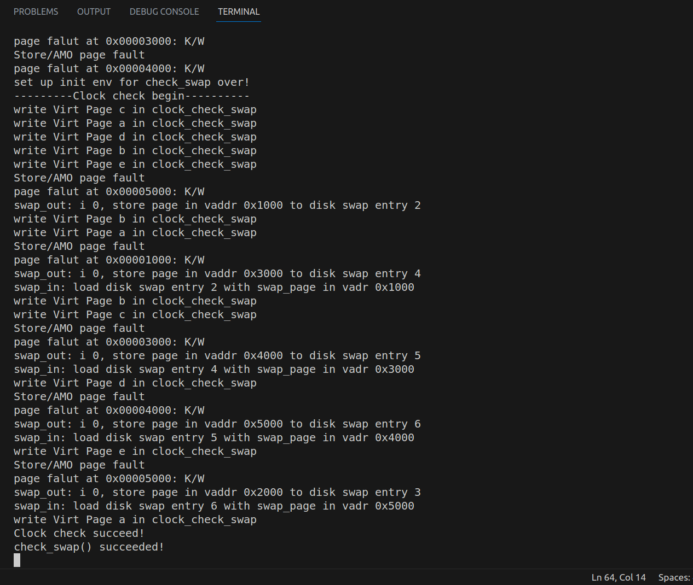

# OS Assignment 9 Report
name：刘乐奇

sid：12011327

Ubuntu用户名：lynchrocket

## What happens when the process accesses a memory page not presenting in the physical memory.

When the process accesses a memory page not presenting in the physical memory, a page fault will happen and an interrupt will be triggered. Then operating system will look up the address from PTE and request the disk for the required page. After disk I/O, operating system will update the PTE in the page table with the present bit to be 1 and PFN to be the memory location. And then retry the instruction. The next time the instruction executed, it will successfully access the page in the physical memory.

## Realize Clock algorithm

Implementation of `swap_clock.c` is as below.

The running result is as below.

