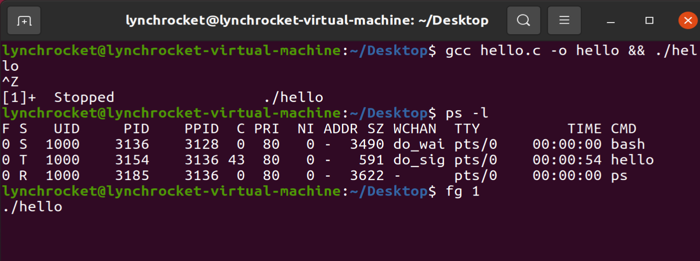

# OS lab1 report

姓名：刘乐奇
学号：12011327
Ubuntu用户名：lynchrocket

## 1. ubuntu 中 terminal 终端光标左侧 $ 前面的文字是什么含义，如何更改 terminal 当前执行目录路径？

\$ 前面的文字是代表当前工作目录，即当前执行目录路径。

使用命令 `cd [path]` 能更改 terminal 当前执行目录路径（`cd ..` 回退到当前目录的上一层）

## 2. 如何通过 terminal 将文件重命名

使用命令 `mv [name1] [name2]` 将文件 name1 重命名为 name2 （当 name1 和 name2 指定在同一目录下）。

## 3. 在当前文件夹查找所有.c文件可以使用哪个命令

`find *.c` 或者 `ls | grep .c`

## 4. "chmod 253 test.txt"命令是什么作用

设置文件 test.txt 的权限为：user 组不可读可写不可执行，group 组可读不可写可执行，other 组不可读可写可执行。

## 5. terminal中运行一个死循环c程序，截图它的pid号及R+状态，通过本次文档介绍的某条指令将其进入T(暂停)状态（截图），将其恢复运行（截图），再停止该进程（截图）

编写 `hello.c` 程序如下：
```c
int main()
{
    while(1)
    {}

    return 0;
}
```
使用命令 `gcc hello.c -o hello && ./hello` 编译并运行。打开另一个命令窗口，输入命令 `ps -a` 查看 pid 号。


按 `ctrl+z` 暂停前台进程。可以看到进程的 job 号为 1。


然后用命令 `ps -l` 查看进程状态。输入命令 `fg 1` 恢复运行。



然后按 `ctrl+c` 停止该进程。


## 6. 截图运行成功的qemu


## 7. 通过什么方式可以退出qemu

按 `ctrl+a` 然后按 `x`

## 8. 截图安装成功的riscv-gcc编译器的版本号


## 9. 实验课课堂报告需要以什么文件格式提交？如未按照该格式提交会有什么后果？

以 pdf 的格式提交。格式错误得 0 分。

## 10. 本课程是否允许抄袭或作弊行为？如有该行为被抄袭者与抄袭者是否均会受到处罚？会受到什么样的处罚？

不允许抄袭或作弊行为。被抄袭者与抄袭者均会受到处罚。第⼀次本次作业计0分，第⼆次课程计0分，不能参与保研以及计系助教。