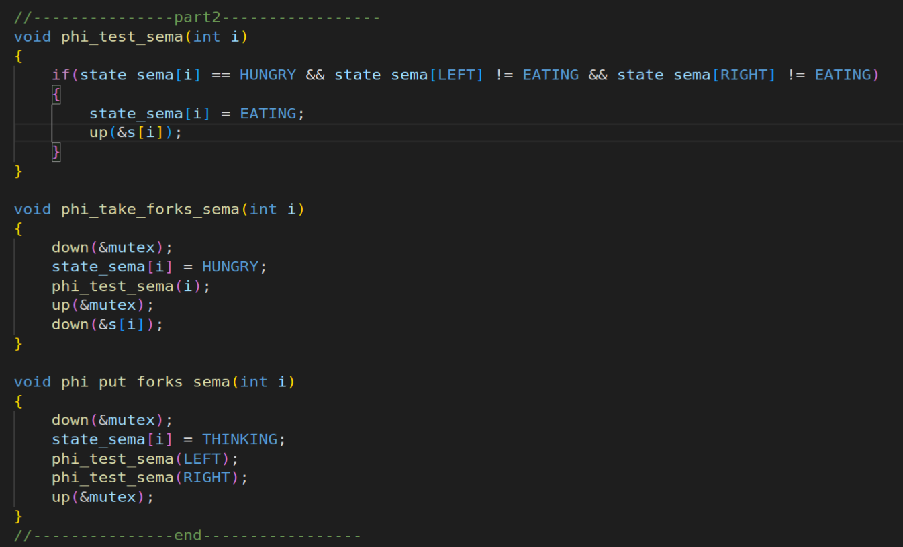
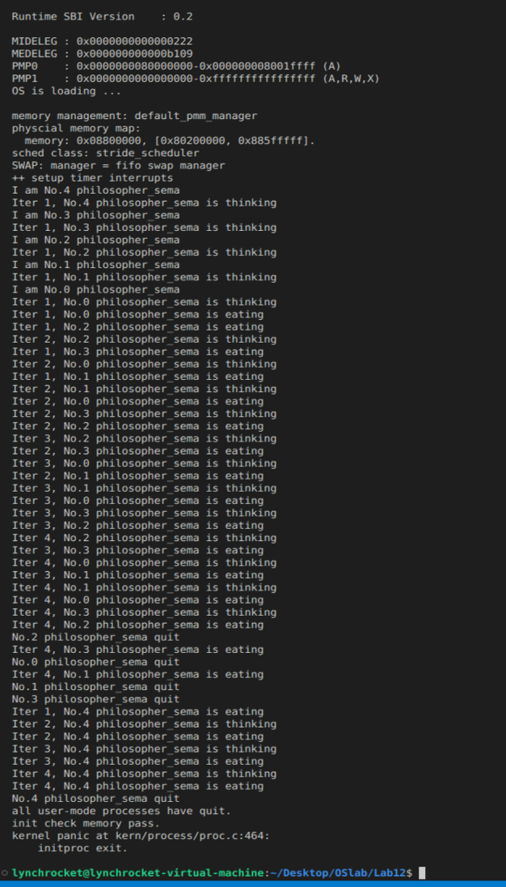

# OS lab12 Report
name：刘乐奇

sid：12011327

Ubuntu用户名：lynchrocket

## 解释 local_intr_save(intr_flag); 的作用

在进行某些同步互斥的操作的时候需要先禁用中断，等执行完之后再用 local_intr_restore(intr_flag); 打开中断。

## 在proc.c中，init_main在852行执行了check_sync()方法。方法通过sync/check_sync.c中part1的算法解决哲学家吃饭问题。

### （1）请描述part1的算法，并回答该算法是否能避免死锁？为什么？

part1能避免死锁。因为当一个进程调用 phi_take_forks_sema() 后，会占有 mutex 锁，直到获得全部资源，在此期间其他进程不会进入去抢夺资源。

### （2）注释掉part1，并在part2中实现理论课件中哲学家问题的final solution算法（代码截图，运行结果截图）

