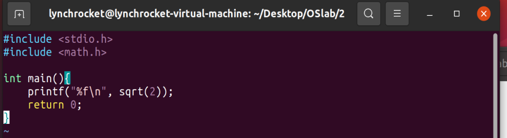
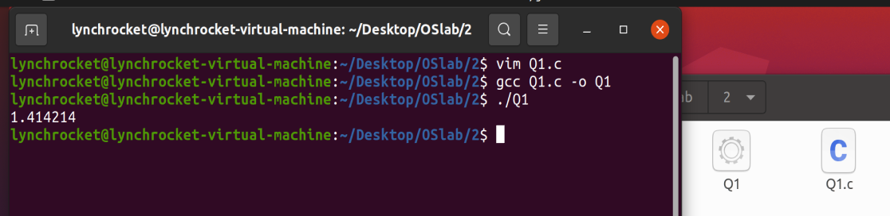
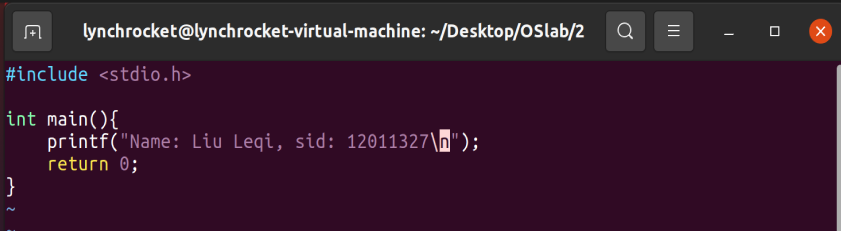
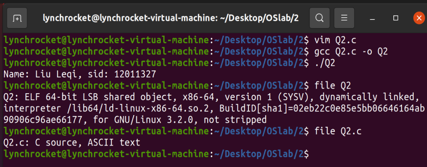
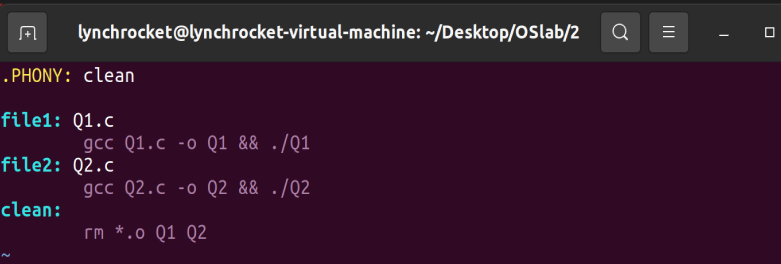
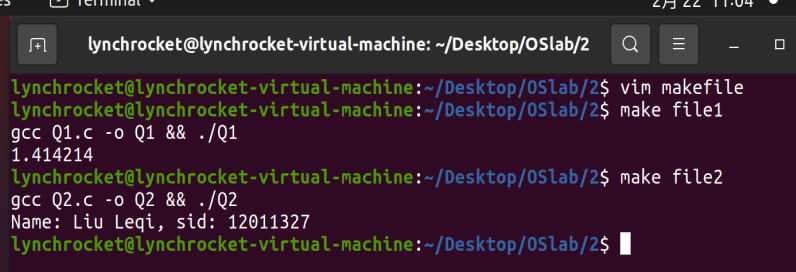
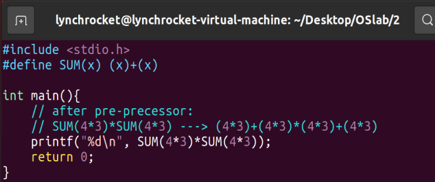
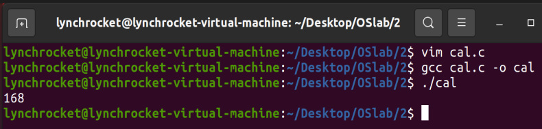

# OS lab2 report

姓名：刘乐奇
学号：12011327
Ubuntu用户名：lynchrocket

## 1. 编写c代码存在Q1.c中(截图)，代码中使用math库中的sqrt函数，对2进行开方，并打印结果。用gcc命令生成可执行文件Q1并执行(截图)。

Q1.c 代码编写如下：

gcc 生成可执行文件并执行：

## 2. 编写c代码存在Q2.c中,请实现一个可以打印自己姓名和学号的C语言程序(截图)。用gcc生成目标文件Q2.o，然后生成可执行文件Q2并执行。用file命令查看文件类型(截图)。

Q2.c 代码编写如下：

gcc 生成可执行文件并执行，以及 file 查看文件类型：

## 3. 请总结C语言的编译过程。

* 源文件（\*.c）经过**预处理**后会将#include，#define等一些宏拓展为c代码(\*.c)（类似于token级别的字符串替换）；
* 将拓展后的c代码（\*.c）进行编译与优化，即检查代码语法并分析，若无错误，将产生如汇编的代码中间代码（\*.s）。同时会对代码进行优化（\*.s）；
* 将生成的中间代码（\*.s）经过汇编器后会生成对象文件（\*.o）；
* 若有多文件依赖，如#include了动态/静态链接库，链接器会将对象文件和库文件链接起来，生成可执行文件。

## 4. windows和ubuntu下的可执行文件的格式分别是什么？

Windows: exe

Ubuntu: elf

## 5. 请编写makefile文件(截图)，执行make命令或者执行make file1时通过Q1打印2的开方结果(截图)，执行make file2时通过Q2打印自己的姓名学号(截图)。

编写 makefile 如下：

执行命令：

## 6. 给定宏定义 #define SUM(x) (x)+(x) , SUM(4\*3)\*SUM(4\*3)的计算结果是什么？

168

