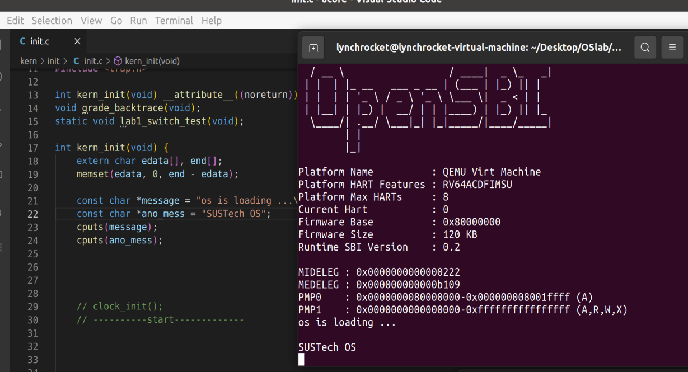
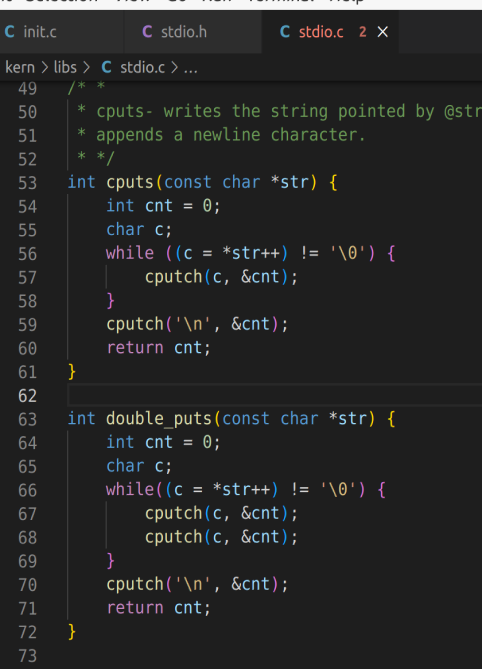
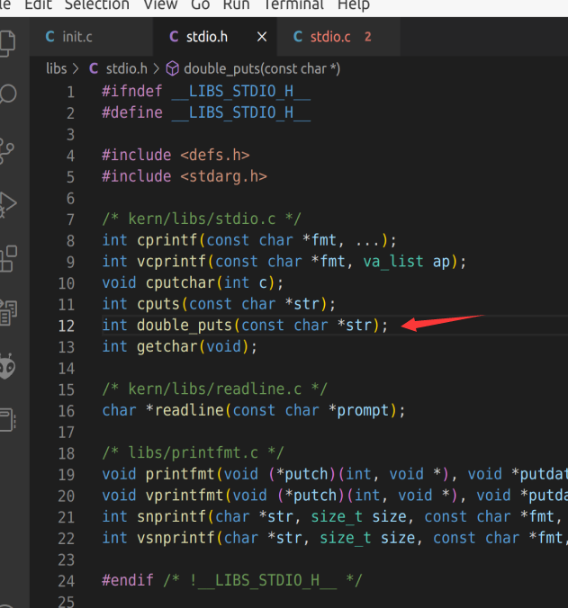
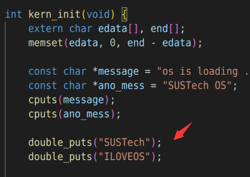
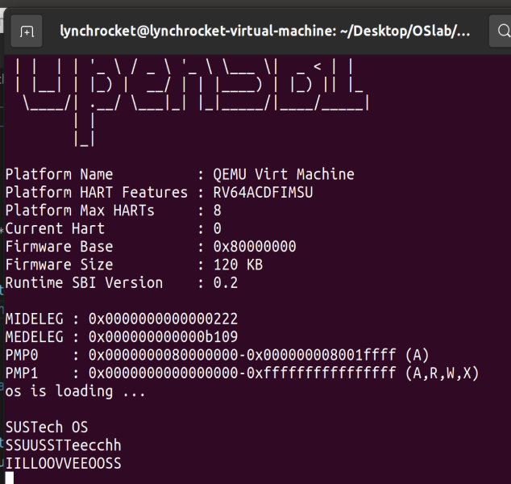

# OS lab3 report
Name: 刘乐奇
sid: 12011327
Ubuntu用户名: lynchrocket

## 请详细描述本节课最小化内核的启动过程

执行 `make qemu` 时，对应于执行
```
qemu-system-riscv64 \
-machine virt \
-nographic \
-bios default \
-device loader,file=bin/ucore.bin,addr=0x80200000
```
这条指令相当于给模拟的计算机插电，然后qemu会调用内置的OpenSBI作为我们的bootloader。OpenSBI 所做的一件事情就是把 CPU 从 M Mode 切换到 S Mode，接着跳转到一个固定地址0x80200000，开始执行内核代码。

## ELF和BIN文件的区别是什么

ELF文件是linux系统上的主要可执行文件的格式，比较复杂；BIN文件是二进制可执行文件，比较简单。

## 链接脚本的作用是什么

链接器能把输入文件（往往是.o文件）连接成输出文件（往往是elf文件），而输入文件和输出文件都有很多section。连接脚本会描述怎样把输入文件的section映射到输出文件的section, 同时规定这些section的内存布局。

## 在init.c （截图）使用cputs函数，使得在最小化内核启动后通过cputs打印出“SUSTech OS”（截图）

init.c代码如截图左边，cputs打印效果如截图右边。



## 在stdio.c中参考cputs()函数实现double_puts()函数（截图），将输出的字符串每个字符打印两次，如double_puts("SUSTech")应输出"SSUUSSTTeecchh"。在init.c中调用该函数（截图），并使得最小化内核启动后输出“IILLOOVVEEOOSS”（截图）。

在 kern/libs/stdio.c 中编写如下代码



在 libs/stdio.h 中增加函数声明



在 kern/init/init.c 中编写如下代码



在qemu中显示如下

