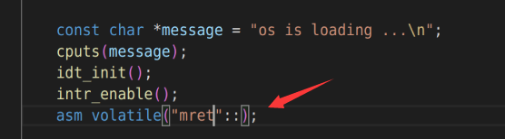
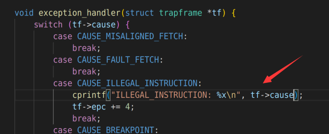
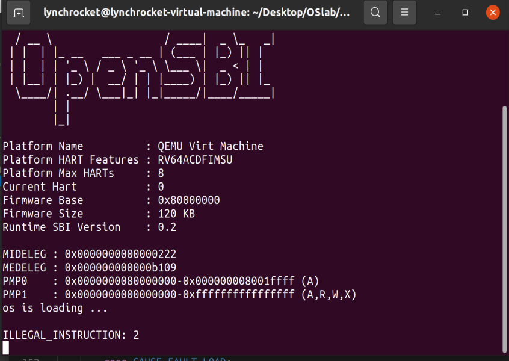

# OS lab4 report
Name: 刘乐奇 \
sid: 12011327 \
Ubuntu用户名: lynchrocket

## 请自己总结执行ebreak后，我们的操作系统是如何进行断点中断处理的

ebreak指令会产生一个断点中断信号，操作系统会在抓到中断后先进行现场保护（保存上下文），然后CPU会寻找stvec寄存器中的值并跳转到这个位置（即中断响应函数所在的代码入口地址）进行中断处理，执行完对应代码后再回到中断响应时的现场（恢复上下文）。

## 请阅读手册，描述epc寄存器的作用

epc寄存器会记录触发中断的那条指令的地址，用于在中断结束时返回到中断之前的地址。

## 编程题：触发一条非法指令异常（ILLEGAL_INSTRUCTION），在 kern/trap/trap.c 的异常处理函数中捕获，并对其进行处理，简单输出异常类型和指令即可。截图你涉及到的代码。
*(提示：可以在S态执行mret汇编指令进行触发)*

修改代码 \
kern/init/init.c

kern/trap/trap.c

执行结果
