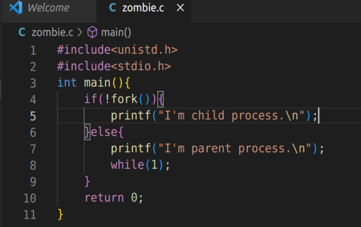
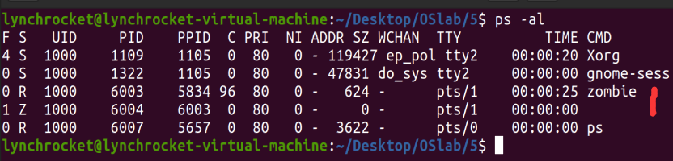

# OS Lab5 Report
name: 刘乐奇 \
sid: 12011327 \
Ubuntu用户名: lynchrocket

## 1. 代码中如何区分父子进程？父子进程的执行顺序是否是固定的？

子进程的pid一般是父进程的pid+1；fork()的返回值，在父进程中是子进程的pid，在子进程中是0。父子进程的执行顺序要看CPU调度，不是固定的。

## 2. 请回答第四步僵尸进程中列举的第4种情况的结果会是什么。

父进程不执行wait()，父进程比子进程先结束。在父进程结束时，子进程会过继给继父进程（init进程或者祖父进程），由继父进程来回收未来结束的子进程。

## 3. 请编写一段c语言代码（截图），用于产生僵尸进程，并截图僵尸进程的状态(ps)。

C语言代码如图

僵尸进程的状态如图

## 4. lab5的ucore代码具体通过哪条指令以什么形式跳转至init_main()

在`/kern/process/proc.c`的`proc_init()`函数中调用了`int pid = kernel_thread(init_main, "Hello world!!", 0)`。在这个函数里将`init_main()`函数的地址复制到中断帧的s0寄存器中，并在最后调用了`do_fork()`函数创建新进程。

之后在`/kern/init/init.c`中调用了`cpu_idle()`函数，其中调用了`schedule()`函数，在这个函数中切换进程。

由于在初始化的时候对中断帧做了一点手脚， epc 寄存器指向的是
`kernel_thread_entry`。在`kernel_thread_entry`中跳转到s0寄存器保存的地址，也即`init_main()`函数的地址。

## 5. lab5的ucore代码中是如何调用forkret和forkrets的，forkrets的具体功能是什么？

在`/kern/init/init.c`中调用了`proc_init()`函数。在这个函数里通过`int pid = kernel_thread()`调用了`kernel_thread()`函数。在这个函数里设置了中断帧的一些参数，并在最后调用了`do_fork()`函数创建新进程。

之后在`/kern/init/init.c`中调用了`cpu_idle()`函数，其中调用了`schedule()`函数，在这个函数中调用了`proc_run()`函数，其中调用`switch_to()`函数来进行上下文切换。`switch_to()`函数中 保存了寄存器中的值，然后跳转到ra寄存器保存的地址。由于之前ra寄存器中保存了`forkret()`函数的地址，所以此处会调用`forkret()`函数。`forkret()`函数中调用了`forkrets()`函数。

`forkrets()`函数把传进来的参数，也就是进程的中断帧放在了sp寄存器中，这样在 `__trapret` 中就可以直接从中断帧里面恢复所有的寄存器。