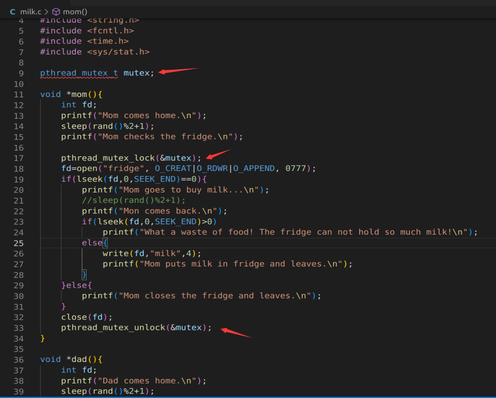
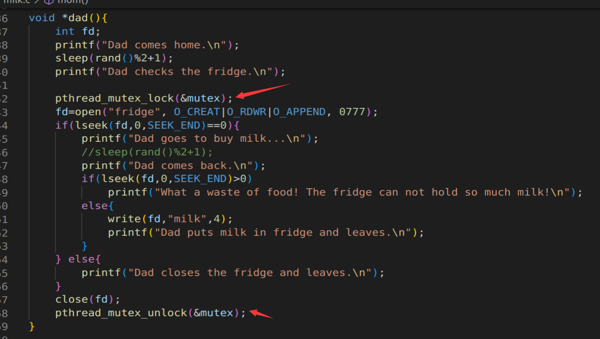
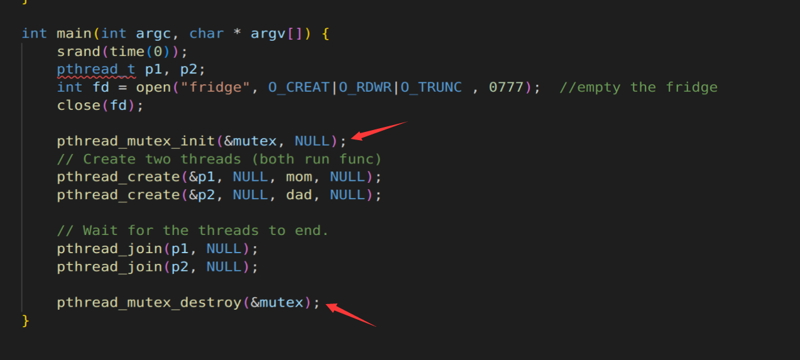
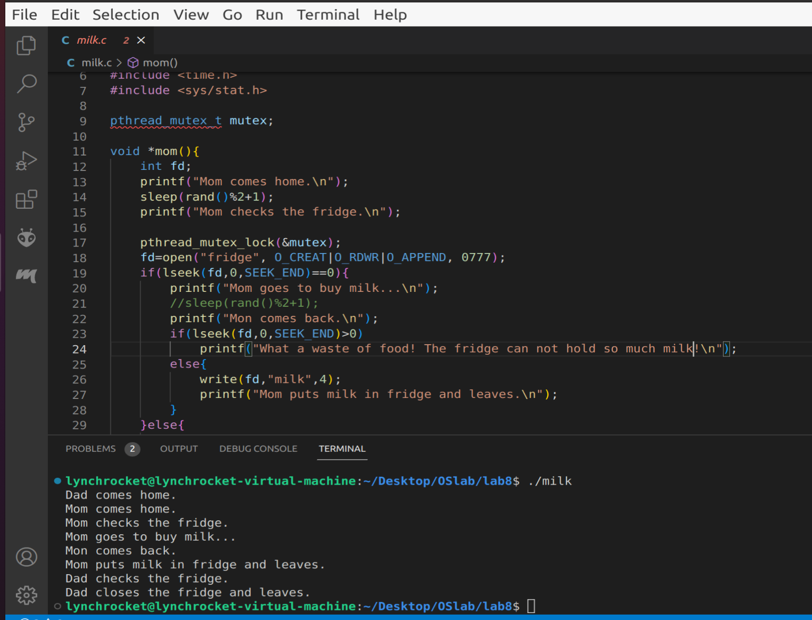
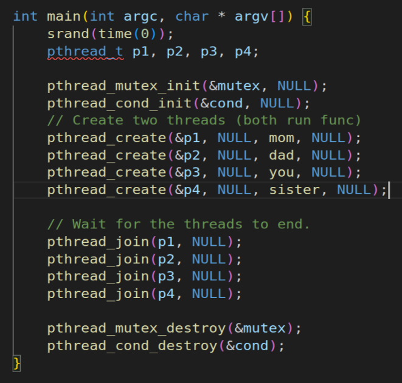
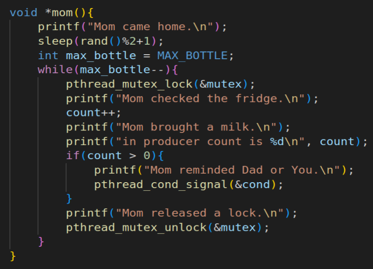
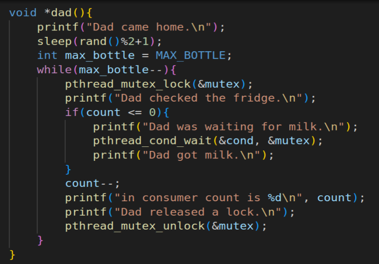
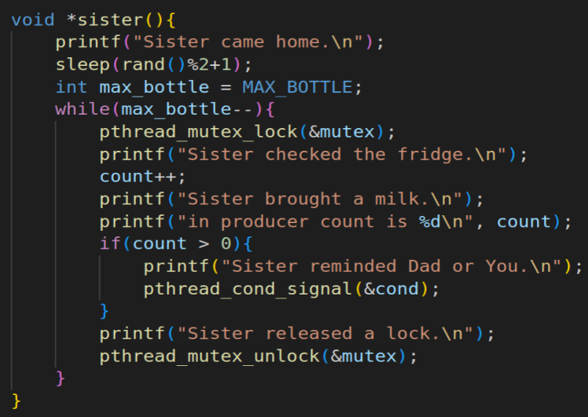
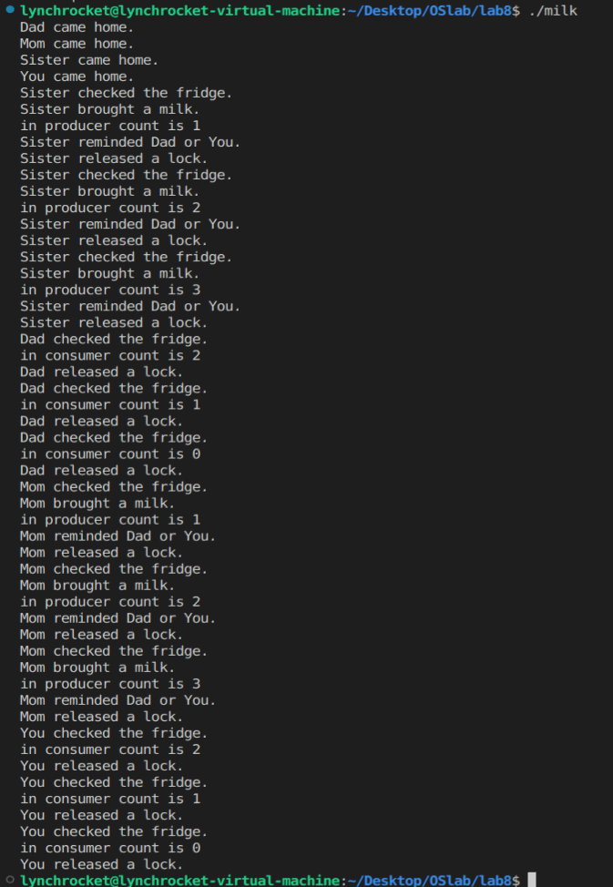

# OS lab8 Report
name: 刘乐奇

sid: 12011327

Ubuntu用户名: lynchrocket

## 1. 使用mutex解决too much milk problem，直接修改milk.c，报告中包含代码截图及运行结果截图。

代码截图







运行结果截图



## 2. 基于milk.c使用condition variable实现第四步中new problem的solution，报告中需要包含main()，mom()，dad()，you()，sister()的实现代码截图，以及运行结果截图。

变量定义
```c
#define MAX_BOTTLE 3
int count = 0;
pthread_mutex_t mutex;
pthread_cond_t cond;
```

main()，mom()，dad()，you()，sister()的实现代码截图










运行结果截图

